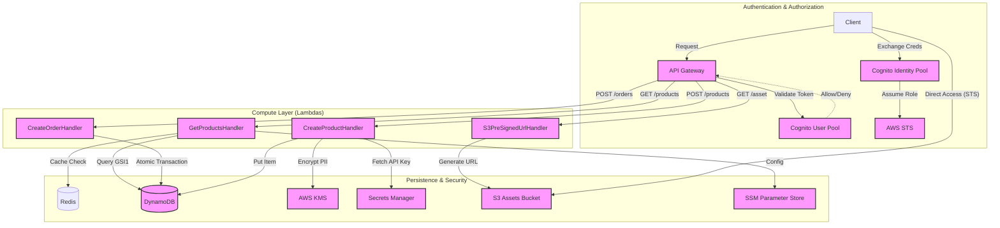
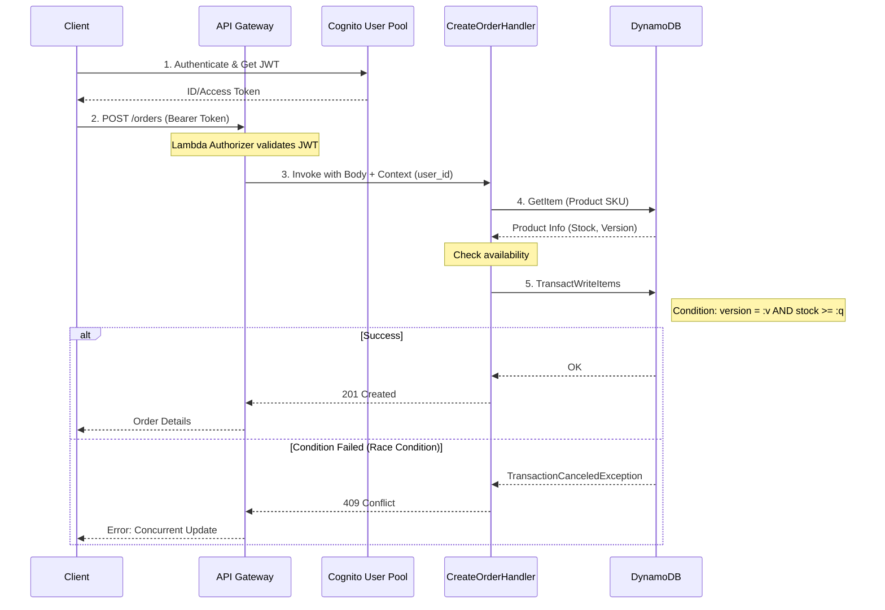
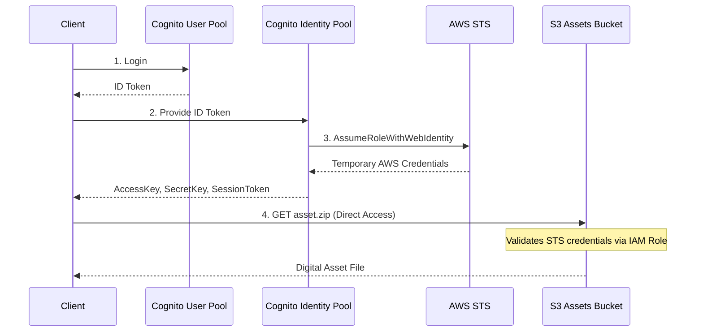
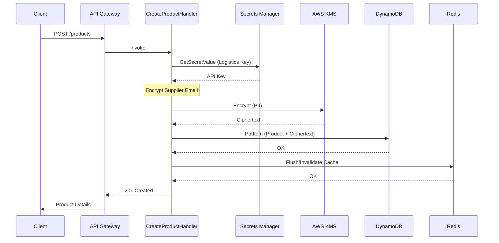

# Secure Serverless Marketplace

A high-performance, secure backend for a digital marketplace leveraging modern cloud-native patterns.

## 🏗 Architecture



### 🔄 Key Process Flows

#### Order Placement (Optimistic Locking)


#### Direct S3 Access (Cognito Identity Pool + STS)


#### Product Creation (Security & Cache)


- **Compute:** AWS Lambda (Java 17) + **Lambda Layers** (Shared Utilities)
- **API:** Amazon API Gateway (Throttling: 10 RPS, Caching: 60s)
- **Database:** Amazon DynamoDB (Single-table design)
    - **GSI1:** Category-based search (`PK: category`, `SK: price`)
    - **GSI2:** User order history (`PK: GSI_PK`, `SK: timestamp`)
- **Security:** AWS KMS (PII Encryption), Secrets Manager (API Keys), **Cognito User Pools** (AuthN), **Cognito Identity Pools + STS** (Direct S3 Access).
- **Concurrency:** Optimistic Locking with `version` attribute.
- **Infrastructure:** AWS SAM + LocalStack

## 🚀 Getting Started

### Prerequisites
- Docker & Docker Compose
- Java 17+ & Maven
- AWS SAM CLI & `awslocal`

### 1. Start Local Environment
```bash
docker compose up -d
```

### 2. Setup Resources (LocalStack)
The setup script `run_all.sh` handles the initialization of all resources, including DynamoDB tables, S3 buckets, SSM parameters, Secrets Manager secrets, and **Cognito User/Identity Pools**.

```bash
./run_all.sh
```

### 3. Manual Build (Optional)
If you need to build the project manually, ensure you build the Lambda Layer first:

```bash
# Build Shared Layer
cd layers/marketplace-utils
mvn clean install

# Build Main Project
cd ../..
mvn clean package
```

## 🧪 Testing
The project includes a comprehensive testing suite:

### Unit Tests
Focused on business logic in isolation.
```bash
mvn test -Dtest="*HandlerTest"
```

### Integration Tests
Verify end-to-end flows using LocalStack.
- **Product Flow**: Basic CRUD operations.
- **Order Flow**: Transactions and stock management.
- **Concurrency**: Optimistic locking verification (race conditions).
- **Security**: Verifying PII encryption at rest in DynamoDB.
- **S3**: Pre-signed URL validity and accessibility.

```bash
# Ensure LocalStack is running first
AWS_ACCESS_KEY_ID=test AWS_SECRET_ACCESS_KEY=test AWS_REGION=us-east-1 \
AWS_ENDPOINT_URL=http://localhost:4566 TABLE_NAME=Products \
mvn test -Dtest="*IntegrationTest"
```

### Load Tests (k6)
Simulate high traffic and verify RPS limits.
```bash
docker run --rm --add-host=host.docker.internal:host-gateway -v $(pwd)/load-tests:/io -i grafana/k6 run /io/performance-test.js
```

### Automated Setup & Test
Runs environment cleanup, build, infrastructure init, unit tests, integration tests, and load tests:
```bash
chmod +x run_all.sh
./run_all.sh
```

## ⚙️ CI/CD Pipeline

The project includes a **GitHub Actions** workflow (`.github/workflows/ci.yml`) that automates:
- **Build**: Compiles the Marketplace Utils layer and the main application.
- **Unit Testing**: Runs Java unit tests on every push.
- **Integration Testing**: Spin up **LocalStack** and **Redis** as services in the runner to verify end-to-end flows in a clean environment.
- **SAM Validation**: Ensures the `template.yaml` is valid and ready for deployment.

## 🧠 Technical Lessons Learned (Gotchas)
- **Networking:** On Linux, when using SAM inside a container, use the host IP (e.g., `172.17.0.1` from `docker0`) for `AWS_ENDPOINT_URL` to reach LocalStack.
- **S3 Path Style:** LocalStack requires `pathStyleAccessEnabled(true)` for both S3 Client and S3 Presigner to correctly resolve buckets without DNS manipulation.
- **Dependency Injection:** Lambda handlers are refactored with package-private constructors to allow mocking of AWS SDK clients during unit tests.
- **TransactionWriteItems:** Used for orders to ensure that stock decrement and order creation happen atomically.
- **DynamoDB DAX vs Redis:** While Redis is used here for aggregating product lists, **DynamoDB DAX** (DynamoDB Accelerator) is the recommended pattern for microsecond-latency read-intensive applications that require direct API compatibility with DynamoDB.
- **Shaded JARs:** SAM local can sometimes fail if a directory exists with the same name as the JAR file in `target/`. Always ensure `mvn clean` is run.

