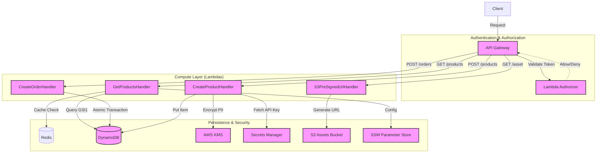
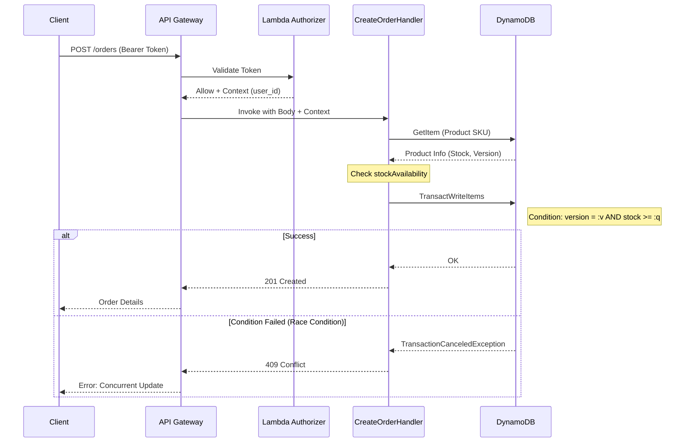
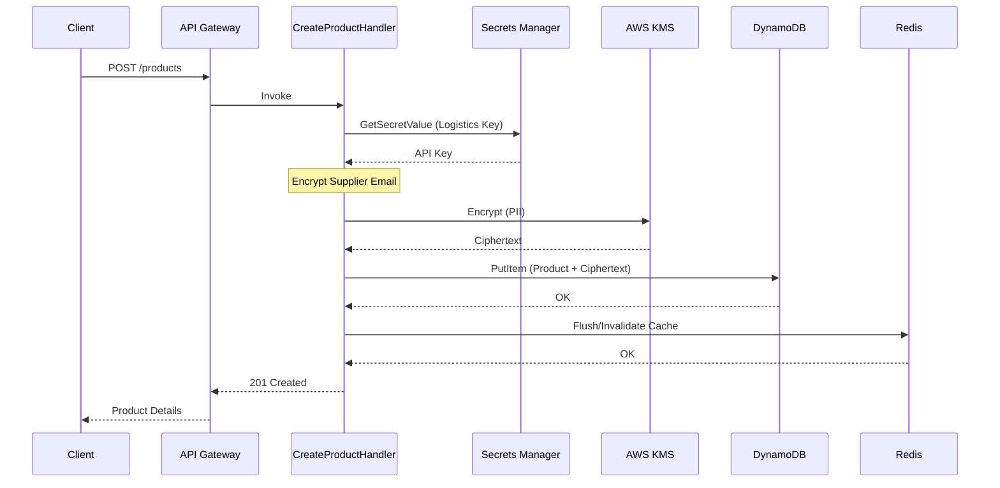

# Secure Serverless Marketplace

A high-performance, secure backend for a digital marketplace leveraging modern cloud-native patterns.

## 🏗 Architecture



### 🔄 Key Process Flows

#### Order Placement (Optimistic Locking)


#### Product Creation (Security & Cache)


- **Compute:** AWS Lambda (Java 17)
- **API:** Amazon API Gateway (Throttling: 10 RPS, Caching: 60s)
- **Database:** Amazon DynamoDB (Single-table design)
    - **GSI1:** Category-based search (`PK: category`, `SK: price`)
    - **GSI2:** User order history (`PK: GSI_PK`, `SK: timestamp`)
- **Security:** AWS KMS (PII Encryption), Secrets Manager (API Keys), IAM (Least Privilege)
- **Concurrency:** Optimistic Locking with `version` attribute.
- **Infrastructure:** AWS SAM + LocalStack

## 🚀 Getting Started

### Prerequisites
- Docker & Docker Compose
- Java 17+ & Maven
- AWS SAM CLI & `awslocal`

### 1. Start Local Environment
```bash
docker compose up -d
```

### 2. Setup Resources (LocalStack)
Before running the API, configure the infrastructure in LocalStack:
```bash
# Table setup
awslocal dynamodb create-table --table-name Products \
  --attribute-definitions AttributeName=PK,AttributeType=S AttributeName=SK,AttributeType=S AttributeName=category,AttributeType=S AttributeName=price,AttributeType=N AttributeName=GSI_PK,AttributeType=S AttributeName=timestamp,AttributeType=N \
  --key-schema AttributeName=PK,KeyType=HASH AttributeName=SK,KeyType=RANGE \
  --global-secondary-indexes "[{\"IndexName\":\"GSI1\",\"KeySchema\":[{\"AttributeName\":\"category\",\"KeyType\":\"HASH\"},{\"AttributeName\":\"price\",\"KeyType\":\"RANGE\"}],\"Projection\":{\"ProjectionType\":\"ALL\"}},{\"IndexName\":\"GSI2\",\"KeySchema\":[{\"AttributeName\":\"GSI_PK\",\"KeyType\":\"HASH\"},{\"AttributeName\":\"timestamp\",\"KeyType\":\"RANGE\"}],\"Projection\":{\"ProjectionType\":\"ALL\"}}]" \
  --billing-mode PAY_PER_REQUEST

# Config & Secrets
awslocal ssm put-parameter --name "/marketplace/table_name" --type "String" --value "Products"
awslocal secretsmanager create-secret --name "LogisticsApiKey" --secret-string '{"api_key": "super-secret-key-123"}'
```

### 3. Build & Run Locally
```bash
mvn package
./run_all.sh
```

## 🧪 Testing
The project includes a comprehensive testing suite:

### Unit Tests
Focused on business logic in isolation.
```bash
mvn test -Dtest="*HandlerTest"
```

### Integration Tests
Verify end-to-end flows using LocalStack.
- **Product Flow**: Basic CRUD operations.
- **Order Flow**: Transactions and stock management.
- **Concurrency**: Optimistic locking verification (race conditions).
- **Security**: Verifying PII encryption at rest in DynamoDB.
- **S3**: Pre-signed URL validity and accessibility.

```bash
# Ensure LocalStack is running first
AWS_ACCESS_KEY_ID=test AWS_SECRET_ACCESS_KEY=test AWS_REGION=us-east-1 \
AWS_ENDPOINT_URL=http://localhost:4566 TABLE_NAME=Products \
mvn test -Dtest="*IntegrationTest"
```

### Load Tests (k6)
Simulate high traffic and verify RPS limits.
```bash
docker run --rm --add-host=host.docker.internal:host-gateway -v $(pwd)/load-tests:/io -i grafana/k6 run /io/performance-test.js
```

### Automated Setup & Test
Runs environment cleanup, build, infrastructure init, unit tests, integration tests, and load tests:
```bash
chmod +x run_all.sh
./run_all.sh
```

## 🧠 Technical Lessons Learned (Gotchas)
- **Networking:** On Linux, when using SAM inside a container, use the host IP (e.g., `172.17.0.1` from `docker0`) for `AWS_ENDPOINT_URL` to reach LocalStack.
- **S3 Path Style:** LocalStack requires `pathStyleAccessEnabled(true)` for both S3 Client and S3 Presigner to correctly resolve buckets without DNS manipulation.
- **Dependency Injection:** Lambda handlers are refactored with package-private constructors to allow mocking of AWS SDK clients during unit tests.
- **TransactionWriteItems:** Used for orders to ensure that stock decrement and order creation happen atomically.
- **Shaded JARs:** SAM local can sometimes fail if a directory exists with the same name as the JAR file in `target/`. Always ensure `mvn clean` is run.

